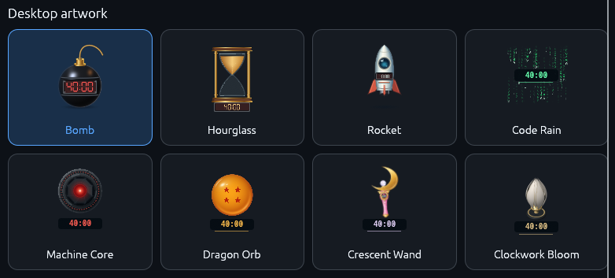
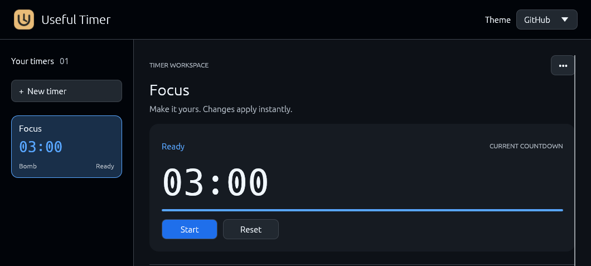

# Useful Timer

Animated countdowns that stay on your desktop. Set a timer for work, a break, cooking, or anything else—and choose artwork that makes it yours.

- Run several timers at once, each with its own name and sound.
- Move timers around your screen or lock them in place.
- Keep your settings on your computer. No account needed.

## Choose your timer

Eight styles, each with its own animation and completion sound:



| Style | What it does |
| --- | --- |
| **Bomb** | Burns down its fuse, then bursts into sparks and smoke. |
| **Hourglass** | Drains its sand, then flips over. |
| **Rocket** | Counts down to a launch and flies out of view. |
| **Code Rain** | Streams green characters around the countdown. |
| **Machine Core** | Rotates metallic rings around a glowing red lens. |
| **Dragon Orb** | Gently turns a golden glass orb with four red stars. |
| **Crescent Wand** | Floats with falling sparkles, then lights up at the crystal. |
| **Clockwork Bloom** | Opens its porcelain-and-gold petals as time runs out. |

You can change a timer's artwork without restarting its countdown.

## Get the app

[**Download the latest release**](https://github.com/MSpiechowicz/useful-timer/releases/latest)

Choose the download for your computer: Linux, Windows, Intel Mac, or Apple Silicon Mac. You do not need Rust or a developer setup.

For an installation with an app-menu shortcut, use the installer below. It installs for your user account without administrator access.

<details>
<summary><strong>Install on Linux or macOS</strong></summary>

Open **Terminal** and paste:

```sh
curl -fsSL https://raw.githubusercontent.com/MSpiechowicz/useful-timer/main/install.sh | bash
```

- **Linux:** open **Useful Timer** from your applications menu.
- **macOS:** open **Useful Timer.app** in your user's **Applications** folder.

Linux downloads require a 64-bit Intel/AMD system with glibc 2.39 or newer, such as Ubuntu 24.04. Linux ARM and Alpine Linux are not supported by these downloads.

</details>

<details>
<summary><strong>Install on Windows</strong></summary>

Open **PowerShell** (not Command Prompt) and paste:

```powershell
curl.exe -fsSL https://raw.githubusercontent.com/MSpiechowicz/useful-timer/main/install.ps1 -o "$env:TEMP\\useful-timer-install.ps1"; if ($LASTEXITCODE -eq 0) { powershell.exe -NoProfile -ExecutionPolicy Bypass -File "$env:TEMP\\useful-timer-install.ps1" } else { throw 'Installer download failed' }
```

Open **Useful Timer** from the Start menu. Requires 64-bit Intel/AMD Windows; Windows ARM and 32-bit Windows are not supported.

</details>

**Before installing:** releases are unsigned. Windows may show SmartScreen warnings, and macOS may ask for approval in **System Settings → Privacy & Security**. Review the publisher before approving. Installers check downloads for corruption, but that check is not a digital signature.

**Platform note:** desktop behavior has been verified on Linux. Windows and macOS builds are provided, but their desktop behavior still needs native testing.

## Start your first timer

1. Open Useful Timer and choose **+ New timer**.
2. Give it a name and choose its artwork.
3. Set the duration, then select **Create timer**. It appears on your desktop.
4. Press **Start** to begin the countdown.



Drag the timer to move it. Right-click its artwork or title to **Start**, **Pause**, **Resume**, **Reset**, **Lock**, or **Remove** it.

Select a timer in the sidebar to change its settings. Changes apply immediately.

## Set the time your way

- Type **Hours**, **Minutes**, and **Seconds**, or use **+1 / −1 min** and **+5 / −5 min**.
- Pick a **Duration preset**: **30 seconds**, **1, 3, 5, 10, 15, or 30 minutes**, or **1 or 2 hours**.
- Prefer 40 minutes instead of 25? Set **40 minutes**, then choose **Save duration as default**. New timers and **Reset form** use that duration, even after restarting. Existing timers keep their own durations.

Changing **Duration** resets that timer to its new full time. To change a countdown without restarting it, open **Adjust remaining time** while it is running or paused.

**Reset** returns a timer to its configured duration. After a timer finishes, reset it before starting again.

## Make it comfortable

| Setting | Use it to… |
| --- | --- |
| **Size** | Make a desktop timer larger or smaller. |
| **Volume** | Choose the completion sound level from **0% to 100%**. |
| **Mute completion sound** | Keep the visual countdown without sound. |
| **Reduced motion** | Keep time and progress visible with less animation. |
| **Theme** | Switch between blue-accented **GitHub** and warm **Charcoal**. |

Both themes use a dark interface. Your choice controls text, controls, and notification colors independently of your system's light or dark appearance.

In a timer's **•••** menu, **Restore defaults** restores its factory settings, including 25 minutes. It does not erase your saved default duration for new timers.

## Saving, updates, and privacy

- Timers, positions, movement locks, your theme, and your preferred new-timer duration are saved locally.
- Reopening the app restores timers **stopped at their full duration**. Running countdown progress does not survive a restart.
- Closing the control panel quits all timers. They do not continue in the background.
- The app checks GitHub for updates at startup. Install only when you choose to; keep the app open until installation finishes. Restarting after an update resets countdowns.
- **Release notes** opens the release page in your default browser.
- No accounts, analytics, or cloud sync. Timer names and settings are not sent to GitHub. Timers work without an internet connection; the update check still sends normal connection information, such as your IP address, to GitHub.

<details>
<summary><strong>Troubleshooting and technical details</strong></summary>

### If something does not work

- **No sound:** check your default audio output and the timer's mute and volume settings. Timers still work when audio is unavailable.
- **Linux window placement:** the app uses X11, including XWayland on a Wayland desktop. Transparency, movement, and always-on-top behavior depend on your window manager. Native Wayland widgets are not supported.
- **Install or update failed:** retry, or use the [release downloads](https://github.com/MSpiechowicz/useful-timer/releases). Installers require an archive with its matching SHA-256 file. In-app macOS updates require the app in `~/Applications/Useful Timer.app`.

Linux runtime dependencies:

```sh
# Ubuntu 24.04 / Debian with glibc 2.39 or newer
sudo apt-get install -y ca-certificates curl libasound2t64 libx11-6 libxcursor1 libxrandr2 libxi6 libxkbcommon0 libxkbcommon-x11-0 libgl1 xwayland

# Arch Linux
sudo pacman -S --needed ca-certificates curl alsa-lib libx11 libxcursor libxrandr libxi libxkbcommon libxkbcommon-x11 mesa xorg-xwayland
```

### Saved settings and removal

Settings are unencrypted; do not use timer names to store secrets. The app saves periodically and on normal exit. Forced shutdown can lose recent changes.

| Platform | Settings file |
| --- | --- |
| Linux | `${XDG_DATA_HOME:-~/.local/share}/useful-timer/app.ron` |
| macOS | `~/Library/Application Support/useful-timer/app.ron` |
| Windows | `%APPDATA%\useful-timer\data\app.ron` |

Linux's path has been verified. macOS and Windows paths follow [eframe's storage rules](https://docs.rs/eframe/0.36.2/eframe/fn.storage_dir.html).

To clear settings, quit the app first, then delete `app.ron`.

To uninstall, quit the app and remove its installed files and shortcuts. Linux installs the executable under `~/.local/bin` and its launcher and release files under `~/.local/share` (or `XDG_DATA_HOME`). macOS installs to `~/Applications/Useful Timer.app`, with a terminal symlink under `~/.local/bin`. Windows installs under `%LOCALAPPDATA%\Programs\Useful Timer`; also remove its Start menu shortcut and user `PATH` entry. Keep `app.ron` if you want to retain your timers.

Installer options: `install.sh --help` or `install.ps1 -Help`. You can choose a published version and a custom installation directory. Linux and Windows in-app updates replace the current executable; macOS uses the app bundle location above. Updates verify checksums but do not provide signing or notarization.

### Build from source

Use **Rust 1.95 or newer** and build on the system where you will run the app.

- **Linux:** install a C/C++ build toolchain, `pkg-config`, ALSA and X11 development libraries, OpenGL drivers, and XWayland when using a Wayland desktop.
- **macOS:** install the Xcode Command Line Tools (`xcode-select --install`).
- **Windows:** install Visual Studio Build Tools with **Desktop development with C++**, a Windows SDK, and Rust's MSVC toolchain. WebView2 is not required.

```sh
cargo run --locked
# Or build an optimized binary:
cargo build --release --locked
```

The binary is in `target/release`. `cargo install --path . --locked` installs a command-line launcher, but does not create desktop shortcuts or a macOS app bundle.

Checks used by [CI](.github/workflows/build.yml):

```sh
cargo fmt --all -- --check
cargo check --locked
cargo test --locked
cargo clippy --all-targets --locked -- -D warnings
cargo build --release --locked
node --test .github/release/cargo.test.mjs
python3 .github/tests/installers.py
```

Windows also runs `.github/tests/installers.ps1`. Automated checks do not replace desktop and audio testing.

[Release automation](.github/workflows/release.yml) uses Conventional Commits on `main`: `feat:` produces a minor release, `fix:` or `perf:` a patch, and breaking changes a major release. Documentation-only changes do not produce a release. The workflow stamps Cargo versions, builds all platforms, and publishes archives and checksums after successful checks. Do not bump versions manually.

The Crescent Wand's original artwork is in [`assets/crescent-wand.svg`](assets/crescent-wand.svg), inspired by the [Moon Stick reference](https://tamashiiweb.com/item/14739/?wovn=en). Regenerate its bundled atlas with `rsvg-convert assets/crescent-wand.svg -o assets/crescent-wand.png` after editing. Screenshots above are captured from the Linux app.

</details>

## License

[GNU General Public License v3.0 only](LICENSE).
